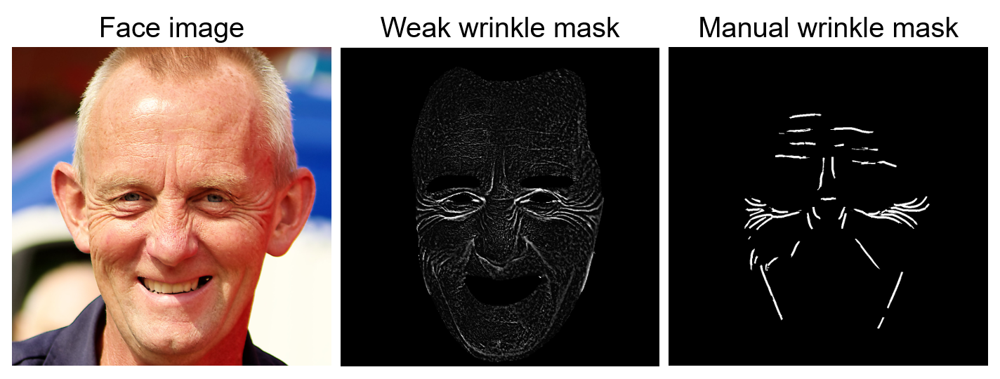

## Flickr-Faces-HQ-Wrinkle Dataset (FFHQ-Wrinkle)


FFHQ-Wrinkle is an extension of the [FFHQ (Flickr-Faces-HQ)](https://github.com/NVlabs/ffhq-dataset) dataset, specifically designed to include additional features related to facial wrinkles. This dataset aims to support research and development in facial recognition, aging simulation, and other related fields.

If you use this dataset for your research, please cite our paper:

> **To Be Updated**<br>

The first public facial wrinkle dataset, ‘FFHQ-Wrinkle’, comprises pairs of face images and their corresponding wrinkle masks. We focused on wrinkle labels while utilizing the existing high-resolution face image dataset [FFHQ (Flickr-Faces-HQ)](https://github.com/NVlabs/ffhq-dataset), which contains 70,000 high-resolution (1024x1024) face images captured under various angles and lighting conditions. The dataset we provide consists of one set of manually labeled wrinkle masks (N=1,000) and one set of "weak" wrinkle masks, or masked texture maps, generated without human labor (N=50,000). We selected 50,000 images from the FFHQ dataset, specifically image IDs 00000 to 49999. We used these 50,000 face images to create the weakly labeled wrinkles and randomly sampled 1,000 images from these to create the ground truth wrinkles.

## Overview

All data is hosted on Google Drive:

| Path | Size | Files | Format | Description
| :--- | :--: | ----: | :----: | :----------
| [ffhq-wrinkle-dataset](https://drive.google.com/drive/folders/1nvZZNpCKSTAbktRasroMswZHRCH3iloN) | 6.95GB |  | | Main folder
| &boxvr;&nbsp; manual-wrinkle-masks | 2.8MB | 1,000 | 8-bit Grayscale PNG (uint8) | Manually annotated wrinkle labels with a resolution of 1024x1024.
| &boxvr;&nbsp; weak-wrinkle-masks | 6.94GB | 50,000 | 8-bit Grayscale PNG (uint8) | Automatically generated weak wrinkle labels with a resolution of 1024x1024.
| &boxur;&nbsp; face-parsed-labels | 5.1MB | 1,000 | Numpy array (npy) | Includes face-parsed labels for face extraction.

## Usage

All scripts must be run from the root folder of the repository (ffhq-wrinkle-dataset).

### Wrinkle label download
To download the wrinkle labels consisting of 1,000 manual wrinkle masks and 50,000 weak wrinkle masks, please run ```download_ffhq_wrinkle.sh```. This script will download both the manual wrinkle masks and weak wrinkle masks into the specified ```base_folder```. 

```bash
bash download_ffhq_wrinkle.sh
```

You can set the default download folder by modifying the ```base_folder``` variable within the ```download_ffhq_wrinkle.sh```. 

Additionally, you can directly download the labels via the provided [Google Drive link](https://drive.google.com/drive/folders/1nvZZNpCKSTAbktRasroMswZHRCH3iloN).

The folder structure after following the instructions is as follows:

```bash
{base_folder}/
├── manual_wrinkle_masks/
│   ├── 00001.png
│   ├── 00011.png
│   ├── ...
│   └── 21035.png
└── weak_wrinkle_masks/
    ├── 00000/
    │   ├── 00000.png
    │   ├── 00001.png
    │   ├── ...
    │   └── 00999.png
    ├── 01000/
    │   ├── 01000.png
    │   ├── 01001.png
    │   ├── ...
    │   └── 01999.png
    ├── ...
    └── 49000/
        ├── 49000.png
        ├── 49001.png
        ├── ...
        └── 49999.png
```

### Face image download

To download the original FFHQ face images, please refer to the [FFHQ Dataset website](https://github.com/NVlabs/ffhq-dataset?tab=readme-ov-file#download-script). We use the 'images1024x1024' subset with IDs from 00000 to 49999 from the original FFHQ dataset. After downloading the images, place them in the designated ```base_folder```. 

The folder structure after downloading face images is as follows:

```bash
{base_folder}/
├── images1024x1024/
│   ├── 00000/
│   │   ├── 00000.png
│   │   ├── 00001.png
│   │   ├── ...
│   │   └── 00999.png
│   ├── ...
│   └── 49000/
│       ├── 49000.png
│       ├── 49001.png
│       ├── ...
│       └── 49999.png
├── manual_wrinkle_masks/
│   ├── 00001.png
│   ├── 00011.png
│   ├── ...
│   └── 21035.png
└── weak_wrinkle_masks/
    ├── 00000/
    │   ├── 00000.png
    │   ├── 00001.png
    │   ├── ...
    │   └── 00999.png
    ├── ...
    └── 49000/
        ├── 49000.png
        ├── 49001.png
        ├── ...
        └── 49999.png
```

### Masked face image preparation and masking guidelines
To follow the training strategy outlined in our paper, you should prepare the face images that corresponding to the manual wrinkle masks, as well as the masked face images where areas other than the face are masked. By running ```face_masking.sh```, you can obtain the face images and masked face images corresponding to the manual wrinkle labels in the base folder. 

```bash
bash face_masking.sh
```
**Note**: To perform this task, the original face images from the [FFHQ Dataset](https://github.com/NVlabs/ffhq-dataset?tab=readme-ov-file#download-script) must be in the ```base_folder```.

Alternatively, you can directly download the face-parsed labels from the [Google Drive link](https://drive.google.com/drive/folders/1nvZZNpCKSTAbktRasroMswZHRCH3iloN) and place them in the ```base_folder```. Then sequentially run ```png_parsing.py``` and ```face_masking.py```.

```bash
python png_parsing.py $base_folder/images1024x1024 $base_folder/manual_wrinkle_masks $base_folder/face_images
python face_masking.py $base_folder/face_parsed_labels $base_folder/face_images $base_folder/masked_face_images
```

We provide face-parsed labels for the face images corresponding to the manual wrinkle labels as 512x512 numpy arrays, which were obtained using [face-parsing.PyTorch](https://github.com/zllrunning/face-parsing.PyTorch). Specifically, we mask all areas except for the face and the nose.


The folder structure after the instructions is as follows:

```bash
{base_folder}/
├── etcs/
│   └── face_parsed_labels/
│       ├── 00000.npy
│       ├── 00011.npy
│       ├── ...
│       └── 21035.npy
├── face_images/
│   ├── 00001.png
│   ├── 00011.png
│   ├── ...
│   └── 21035.png
├── images1024x1024/
│   ├── 00000/
│   │   ├── 00000.png
│   │   ├── 00001.png
│   │   ├── ...
│   │   └── 00999.png
│   ├── ...
│   └── 49000/
│       ├── 49000.png
│       ├── 49001.png
│       ├── ...
│       └── 49999.png
├── manual_wrinkle_masks/
│   ├── 00001.png
│   ├── 00011.png
│   ├── ...
│   └── 21035.png
├── masked_face_images/
│   ├── 00001.png
│   ├── 00011.png
│   ├── ...
│   └── 21035.png
└── weak_wrinkle_masks/
    ├── 00000/
    │   ├── 00000.png
    │   ├── 00001.png
    │   ├── ...
    │   └── 00999.png
    ├── ...
    └── 49000/
        ├── 49000.png
        ├── 49001.png
        ├── ...
        └── 49999.png
```


## Licenses
The FFHQ-Wrinkle dataset is provided under the same [Creative Commons BY-NC-SA 4.0](https://creativecommons.org/licenses/by-nc-sa/4.0/) license as the original FFHQ dataset.
You are free to use, redistribute, and adapt this dataset for non-commercial purposes under the following conditions:

1. Attribution: You must give appropriate credit **by citing our paper**, provide a link to the license, and indicate if changes were made. You may do so in any reasonable manner, but not in any way that suggests the licensor endorses you or your use.
    <!-- > **Example citation: "FFHQ-Wrinkle dataset, derived from the Flickr-Faces-HQ (FFHQ) dataset by NVIDIA Corporation."** -->
2. Non-Commercial: You may not use the material for commercial purposes.
3. ShareAlike: If you remix, transform, or build upon the material, you must distribute your contributions under the same license as the original.

By using the FFHQ-Wrinkle dataset, you agree to abide by the terms of this license. For any further inquiries or requests for commercial use, please contact the original creators of the FFHQ dataset and the authors of the FFHQ-Wrinkle dataset.

The individual images were published in Flickr by their respective authors under either [Creative Commons BY 2.0](https://creativecommons.org/licenses/by/2.0/), [Creative Commons BY-NC 2.0](https://creativecommons.org/licenses/by-nc/2.0/), [Public Domain Mark 1.0](https://creativecommons.org/publicdomain/mark/1.0/), [Public Domain CC0 1.0](https://creativecommons.org/publicdomain/zero/1.0/), or [U.S. Government Works](http://www.usa.gov/copyright.shtml) license. All of these licenses allow **free use, redistribution, and adaptation for non-commercial purposes**. However, some of them require giving **appropriate credit** to the original author, as well as **indicating any changes** that were made to the images. The license and original author of each image are indicated in the metadata.

* [https://creativecommons.org/licenses/by/2.0/](https://creativecommons.org/licenses/by/2.0/)
* [https://creativecommons.org/licenses/by-nc/2.0/](https://creativecommons.org/licenses/by-nc/2.0/)
* [https://creativecommons.org/publicdomain/mark/1.0/](https://creativecommons.org/publicdomain/mark/1.0/)
* [https://creativecommons.org/publicdomain/zero/1.0/](https://creativecommons.org/publicdomain/zero/1.0/)
* [http://www.usa.gov/copyright.shtml](http://www.usa.gov/copyright.shtml)

Please refer to the original [FFHQ Dataset website](https://github.com/NVlabs/ffhq-dataset?tab=License-1-ov-file) for the license of the FFHQ dataset.